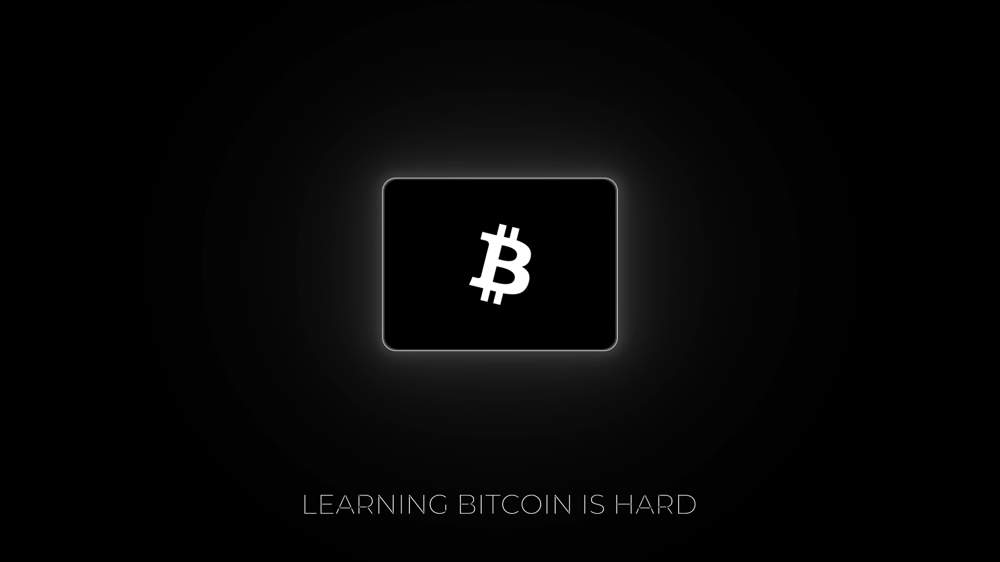

# Getting Started

Welcome to Decoding Bitcoin, your go-to resource for understanding Bitcoin, Privacy, and Decentralization. We're here to break down complex Bitcoin concepts and provide straightforward explanations to help you navigate and master Bitcoin.

## Modules

Explore the core modules of Decoding Bitcoin:

-   **Scripts**: Explore Bitcoin scripts, their structure, and how they define the conditions for transactions.
-   **Keys**: Learn about Bitcoin keys and addresses, their creation, and their role in securing transactions.
-   **Wallets**: Understand the different types of Bitcoin wallets, how they work, and best practices for their use.
-   **Transaction**: Delve into the mechanics of Bitcoin transactions, from creation to confirmation on the blockchain.

## Repository Structure

-   📁 **/decoding** - Contains all topic markdown files
-   📁 **/images** - Contains images related to topics, organized by topic
-   📄 **README.md** - Overview of the repository
-   📄 **CONTRIBUTING.md** - Guidelines for contributing to the repository _(coming soon)_

## Community

Join our [Discord community](https://discord.com/invite/EAy9XMufbY) to ask questions, get help, and connect with other learners!
